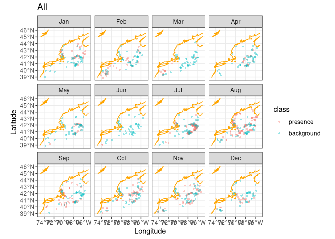
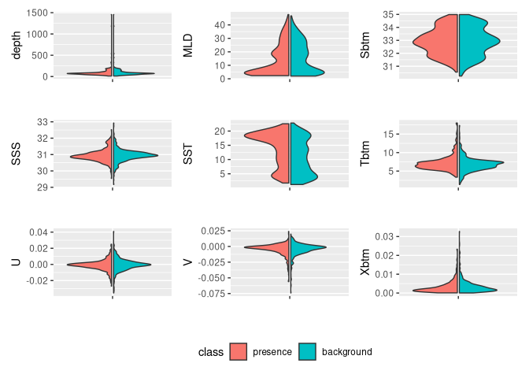

My Second Species
================

The first step of any good script is to setup the environment.

``` r
source("setup.R")
```

Before we think about a second species we must read in the Brickman
data.

``` r
db = brickman_database() |>
  dplyr::filter(scenario == "PRESENT", interval == "mon")
present = read_brickman(add = c("depth"))
```

Looking at species that interact with the North Atlantic Scallop
(Placopecten magellanicus), the most apparent is the Northern Sea Star
(Asterias rubens), the most common predator of the scallops. Lets get
the data from OBIS.

Note: I chose to remove the minimum_year restriction simply to get
enough data to populate each month (keep this in mind when interpreting
results)

``` r
fetch_obis("Asterias rubens")
```

    ## Retrieved 3279 records of approximately 3279 (100%)

    ## Simple feature collection with 3279 features and 7 fields
    ## Geometry type: POINT
    ## Dimension:     XY
    ## Bounding box:  xmin: -74.633 ymin: 38.80833 xmax: -65.01083 ymax: 45.41467
    ## Geodetic CRS:  WGS 84
    ## # A tibble: 3,279 × 8
    ##    id             basisOfRecord eventDate   year month eventTime individualCount
    ##  * <chr>          <chr>         <date>     <dbl> <fct> <chr>               <dbl>
    ##  1 000d5d55-8a01… MaterialSamp… 2021-08-18  2021 Aug   <NA>                   NA
    ##  2 00164e01-9417… HumanObserva… 2011-07-09  2011 Jul   <NA>                   NA
    ##  3 004210b1-6f7b… PreservedSpe… 1965-02-11  1965 Feb   <NA>                    1
    ##  4 0046fd9b-c25d… PreservedSpe… 1967-07-10  1967 Jul   <NA>                    2
    ##  5 0057b7cb-4a32… PreservedSpe… 1965-09-24  1965 Sep   <NA>                    1
    ##  6 008deccd-bb22… HumanObserva… 1905-08-12  1905 Aug   <NA>                   NA
    ##  7 0090a1fc-1b01… HumanObserva… 1905-07-24  1905 Jul   <NA>                   NA
    ##  8 00b26050-f3e6… PreservedSpe… 1968-03-07  1968 Mar   <NA>                    2
    ##  9 00bdd944-545f… HumanObserva… 2007-11-21  2007 Nov   <NA>                   NA
    ## 10 00d2cdfe-f378… HumanObserva… 2014-06-05  2014 Jun   13:01:00               NA
    ## # ℹ 3,269 more rows
    ## # ℹ 1 more variable: geometry <POINT [°]>

``` r
obs = read_observations(scientificname = "Asterias rubens", minimum_year = 0)
table(obs$month)
```

    ## 
    ## Jan Feb Mar Apr May Jun Jul Aug Sep Oct Nov Dec 
    ##  39  40  13  17  23   2 123 107  76  58  66  24

Now that we have filtered species data for the Starfish, lets weigh the
observations before populating background points.

``` r
db = brickman_database() |>
  filter(scenario == "STATIC", var == "mask")
mask = read_brickman(db)

bias_map = rasterize_point_density(obs, mask)
```

Next lets actually populate those background points

``` r
all_counts = count(st_drop_geometry(obs), month)
nback_avg = mean(all_counts$n) |>
  round()
nback_avg
```

    ## [1] 49

``` r
obsbkg = sapply(month.abb,
    function(mon){ 
      sample_background(obs |> filter(month == mon), # <- just this month
                       bias_map,
                       method = "bias",  # <-- it needs to know it's a bias map
                       return_pres = TRUE, # <-- give me the obs back, too
                       n = nback_avg) |>   # <-- how many points
        mutate(month = mon, .before = 1)
    }, simplify = FALSE) |>
  bind_rows() |>
  mutate(month = factor(month, levels = month.abb))
obsbkg 
```

    ## Simple feature collection with 1176 features and 2 fields
    ## Geometry type: POINT
    ## Dimension:     XY
    ## Bounding box:  xmin: -74.13333 ymin: 38.85333 xmax: -65.35 ymax: 44.417
    ## Geodetic CRS:  WGS 84
    ## # A tibble: 1,176 × 3
    ##    month class            geometry
    ##  * <fct> <fct>         <POINT [°]>
    ##  1 Jan   presence (-67.267 43.617)
    ##  2 Jan   presence (-67.883 41.967)
    ##  3 Jan   presence (-67.483 40.967)
    ##  4 Jan   presence  (-70.283 42.35)
    ##  5 Jan   presence (-65.633 42.833)
    ##  6 Jan   presence (-66.133 41.833)
    ##  7 Jan   presence (-67.767 42.067)
    ##  8 Jan   presence     (-66.833 42)
    ##  9 Jan   presence  (-70.25 42.467)
    ## 10 Jan   presence (-65.667 42.417)
    ## # ℹ 1,166 more rows

Lets take a look at our presence vs background points, and then save the
model_input.

``` r
coast = read_coastline()

ggplot() +
  geom_sf(data = obsbkg, 
          mapping = aes(col = class),
          alpha =  0.4, shape = "circle small", size = 1) +
  geom_sf(data = coast, col = "orange")  + 
  labs(x = "Longitude", y = "Latitude", title = "All") +   
  theme_bw() +  # <- make a simple white background
  scale_fill_okabe_ito() +  # <-- colorblind friendly for N Record
  facet_wrap(~month)
```

<!-- -->

``` r
model_input = write_model_input(obsbkg, scientificname = "Asterias rubens")
```

Now lets get covariates sorted, and compare them between presence and
background points

``` r
variables = extract_brickman(present, model_input, form = "wide")
variables = variables |>
  select(-.id) 
plot_pres_vs_bg(variables |> select(-month), "class")
```

<!-- -->

From the plots we can tell that mixed layer depth, sea surface
temperature, and bottom temperature are the most telling variables. Now
lets save this config!

``` r
cfg = list(
  version = "v1",
  scientificname = "Asterias rubens",
  background = "average of observations per month",
  keep_vars =  keep)

ok = make_path(data_path("models")) # make a directory for models
write_configuration(cfg)  

write_model_input(variables, scientificname = "Asterias rubens", version = "v1")
```

Success!
